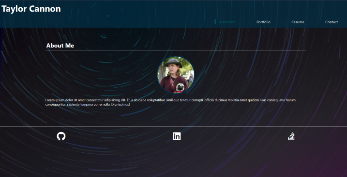

# Portfolio With React

## Descrtiption

This is a rebuild of my portfolio using React. It is a single page website that uses components to display the 4 separate sections. All css was done custom with no external library (other than fontawesome for icons). There are a few things that still need to be added or adjusted such as..
 
- Filler text in bio needs to be replaced with actual info
- Display of projects looks a little odd and i'm not satisfied with the sizing
- Need an  actual resume to be able to download one
- Contact form is not setup to contact me, or anyone else
- Other tweaks to the styling for positioning on page

## Link

Click the image

